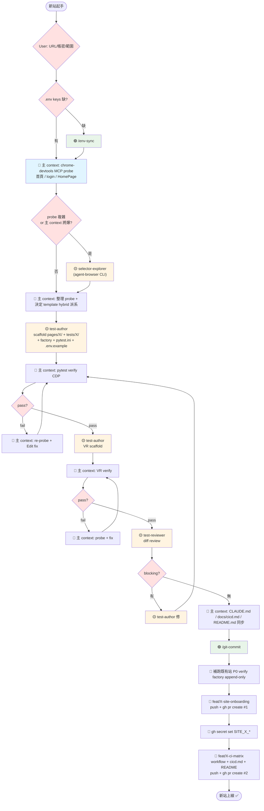

# 新站 Onboarding 工作流程

依 2026-05-25 QW 站（LM來財娛樂城）onboarding 實作經驗整理。後續導入新站（如 KS / LG / LU 等 .env 已有 keys 但 code 未接的站）按此 SOP 走。

## 設計原則：按需啟用

3 個 subagent + 6 個 skill 是「**特定情境的工具**」，不是「**每次必跑**」。每個工具有明確觸發條件，避免為了用而用。

| 工具 | 模式 | 觸發條件 |
|------|------|---------|
| 🟡 test-author | 每次必用 | bulk scaffolding 本職 |
| 🟡 test-reviewer | scaffold 後必用 | 防 cover-up pattern、找 blocking issues |
| 🟡 selector-explorer | 按需啟用 | (1) 主 context tokens 將爆；(2) 與 test-author 並行 probe；(3) 多步驟複雜 probe 想隔離 |
| 🟢 env-sync skill | 條件式 | .env keys 缺時觸發 |
| 🟢 git-commit skill | 每次必用 | commit 前固定走 |
| 🟢 ui-test-author / pom-architect / selector-probe / test-review skill | 隨 subagent 自動載入 | 不需手動觸發 |

## 流程圖

**色碼**：🔵 主 context / 🟡 subagent / 🟢 skill（user 觸發） / 🔴 user 確認點

## 階段詳細

| # | 階段 | 執行者 | 主要動作 | 預估 |
|---|------|-------|---------|------|
| 0 | 前置資訊收集 | user | URL / 帳密在 .env / 範圍（smoke + VR + 是否含 dashboard / API） | 2 min |
| 1 | env-sync（條件式） | 🟢 user 觸發 `/env-sync` | 若 .env 缺 SITE_X_* keys 才走；整合並同步 .env.example | 5 min |
| 2 | Probe 首頁 + 登入頁 | 🔵 主 context chrome-devtools MCP | navigate + evaluate 拿 selector | 5 min |
| 3 | Probe 登入後 HomePage | 🔵 主 context（實際登入） | avatar / dropdown / logout selector + cookie 結構 | 5 min |
| 4 | （條件式）selector-explorer | 🟡 subagent agent-browser CLI | 僅在 step 2/3 太複雜或主 context 將爆時派 | +8 min |
| 5 | 整理 + Template 決策 | 🔵 主 context | hybrid 派系（selector / API），寫進 brief | 3 min |
| 6 | Scaffold pages + smoke + factory | 🟡 test-author subagent | 產 10 個檔（含 __init__、conftest、pytest.ini marker、.env.example） | 10~15 min |
| 7 | Pytest verify + iterate fix | 🔵 主 context CDP pytest + MCP re-probe | 修到 4/4 pass | 10~30 min |
| 8 | VR scaffold | 🟡 test-author subagent | 產 tests/X/feature/visual/ | 5 min |
| 9 | VR verify + iterate fix | 🔵 主 context | 修到 3/3 pass | 5~10 min |
| 10 | Code review | 🟡 test-reviewer subagent | read-only review diff，找 blocking / cover-up | 5~10 min |
| 11 | Doc sync | 🔵 主 context Edit | CLAUDE.md（Architecture / Markers / VR）+ README + docs/cicd.md | 5 min |
| 12 | Commit + PR #1 | 🟢 user 觸發 `/git-commit` | 分支檢查 + secret scan + CDP verify 既有站 + commit msg | 10 min |
| 13 | GH Secrets | 🔵 主 context `gh secret set` | SITE_X_URL/USERNAME/PASSWORD 從 .env 灌入 | 1 min |
| 14 | CI matrix PR #2 | 🔵 主 context | workflow + cicd.md + README 同步 + push + gh pr create | 5 min |
| 15 | Merge + 收尾 | user | gh pr merge --squash --delete-branch | — |

**總計**：~60 min（不含 selector-explorer），~70 min（含）

## QW 過程實際遇到的坑（cheat sheet）

每個都驗證過至少一次，新站 onboarding 預期遇到時直接套用。

| 症狀 | Root cause | 修法 |
|------|----------|------|
| `[type='submit']` selector timeout | button DOM 沒寫 type attribute（HTMLButton default 行為） | 純 class selector（如 `button.solid-btn-shared.auth-btn`） |
| `.avatar-trigger p` strict mode violation | 父層內含多個 p 元素（username / VIP / 餘額） | `to_contain_text(username)` 對父層整體驗 |
| popup-mask 在 dismiss 後又重 render | TOTP 提示淡入時序在 dismiss 公告之後 | dismiss loop 最多 3 輪，每輪結束 check `popup-mask` hidden |
| hover dropdown click 時 element detach | scroll_into_view 或 click 動作打斷 hover state | hover 用 JS dispatchEvent + click 也用 dispatchEvent |
| `wait_until="networkidle"` timeout | 首頁背景 polling 永遠不會 networkidle | 改 `domcontentloaded` + 後續 `wait_for(state="visible")` |
| popup 驗證 immediate count check 失敗 | DCL 後 popup async render 尚未出現 | 改 `wait_for(state="visible", timeout=10000)` |

## CI / 環境設定坑

| 項目 | 細節 |
|---|---|
| Chrome `--remote-debugging-address` | 必須 `0.0.0.0`，**不要 `127.0.0.1`**（Chrome 148 會 IPv6 fallback 到 `[::1]`） |
| portproxy listenaddress | 只用 WSL gateway IP，**不要 `0.0.0.0`**（會跟 Chrome 搶 IPv4 socket） |
| Chrome 視窗 zoom | 必須 **100%**（非 100% 在 dev 環境會觸發額外蓋板廣告） |
| 兩個 Chrome instance | 9223（pytest CDP）與 9224（MCP probe）各自獨立 user-data-dir |

## 何時偏離流程（省工具）

| 情境 | 可省略的步驟 |
|------|------------|
| Clone 既有站 90% 相同 | 跳 step 4（selector-explorer），主 context 直接 probe |
| 改動只動 docstring / 重命名 | 跳 step 10（test-reviewer） |
| .env 已有 keys | step 1（env-sync）自然跳過 |
| Trivial 改動單一檔案 | step 12 可不走完整 git-commit skill，主 context 直接 commit |

但 **每次必走** 的：
- Step 6（test-author scaffold）— scaffold 本身就需要 subagent
- Step 7/9 verify— pytest CDP 實跑驗證必做
- Step 10 review — scaffold 大量新檔不能跳
- Step 12 commit — git-commit skill 的 secret scan + branch 檢查必走

## 相關文件

- `CLAUDE.md` — repo 架構、慣例、fixture 表（每次 onboarding 必讀）
- `docs/cicd.md` — CI/CD trigger / secrets / debug 操作
- `docs/agent-skills-workflow.md` — subagent / skill 完整工作流（補本流程的細節）
- memory `project_pending_2026_05_28.md` — 最新待辦清單（含未完成站點列表）

## 適用案例

下次 onboarding 候選站（依 .env 既有 keys）：

- **KS** — `SITE_KS_*` 已存在
- **LG** — `SITE_LG_*` 已存在
- **LU** — `SITE_LU_*` 已存在

每站照本 SOP 走預期 ~1 hr 完成。
